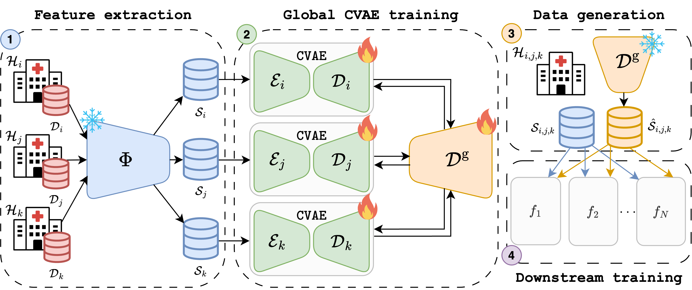

# Embedding-Based Federated Data Sharing via Differentially Private Conditional VAEs @ MICCAI 2025


<p align="center">
    [<a href="https://arxiv.org/abs/2507.02671">Preprint</a>]
    [<a href="https://papers.miccai.org/miccai-2025/paper/0970_paper.pdf">MICCAI Paper</a>]
    [<a href="#citation">Bibtex</a>]
  </p>


## Overview

Deep Learning (DL) has revolutionized medical imaging, yet its adoption is constrained by data scarcity and privacy regulations, limiting access to diverse datasets. Federated Learning (FL) enables decentralized training but suffers from high communication costs and is often restricted to a single downstream task, reducing flexibility. We propose a data-sharing method via Differentially Private (DP) generative models. By adopting foundation models, we extract compact, informative embeddings, reducing redundancy and lowering computational overhead. Clients collaboratively train a Differentially Private Conditional Variational Autoencoder (DP-CVAE) to model a global, privacy-aware data distribution, supporting diverse downstream tasks. Our approach, validated across multiple feature extractors, enhances privacy, scalability, and efficiency, outperforming traditional FL classifiers while ensuring differential privacy. Additionally, DP-CVAE produces higher-fidelity embeddings than DP-CGAN while requiring $5 \times$ fewer parameters.

<p align="center">
   
</p>

**Figure**: Illustration of our proposed methodology. (1) Each client $\mathcal{H}$ encodes its image-based dataset $\mathcal{D}$ into an embedding-based dataset $\mathcal{S}$ using a large, pre-trained foundation model $\mathrm{\Phi}$, reducing data storage requirements and computational overhead. (2) Clients collaboratively train a lightweight DP-CVAE ($\mathcal{E},\mathcal{D}$) and periodically share decoder weights, which are aggregated into a global decoder $\mathcal{D}^{\text{g}}$. This shared decoder captures cross-client variation while preserving local data privacy. (3) Each client independently generates a synthetic dataset $\hat{\mathcal{S}}$ using the globally trained generative model, and (4) utilizes (real) local and (synthetic) global data for any downstream task $f$.


## Usage

### 0. Install dependencies:
```
conda env create -f ./environment.yaml
conda activate fed-dpcvae
```

### 1. Create embedding-based datasets 

#### For [MedMNIST](https://medmnist.com/) datasets such as OrganSMNIST:

```
# Download data
mkdir data/organsmnist/dataset
cd data/organsmnist/dataset 
wget https://zenodo.org/records/10519652/files/organsmnist_224.npz

# Extract embeddings using a foundation model (e.g. DINOv2)
python data/create_db.py \
    --dataset_root data/organsmnist/dataset \
    --database_root data/organsmnist/database \
    --dataset organsmnist \
    --backbone [backbone]
```

#### For [Camelyon17](https://wilds.stanford.edu/datasets/) dataset:

```
# Extract embeddings using a foundation model (e.g. DINOv2) 
python data/create_db.py \
    --dataset_root data/camelyon17/dataset \
    --database_root data/camelyon17/database \ 
    --dataset camelyon17 \
    --indices_root assets/data \
    --backbone [backbone]
```

This uses the provided file `assets/data/hospital_indices.pkl` to generate client splits based on hospitals/medical centers that the data come from. Unlike other datasets, Camelyon17 comes with this natural partitioning of clients, which we will utilize directly.


### 2. Train and evaluate baselines 

We provide scripts to simulate the standard [FedAvg](http://proceedings.mlr.press/v54/mcmahan17a.html) algorithm, its enhanced version [FedProx](https://arxiv.org/abs/1812.06127) as well as FedLambda, our adapted version of [kNN-Per](https://arxiv.org/abs/2111.09360), on embedding-based datasets (as opposed to raw image inputs). These algorithms serve as baselines for our proposed method. You can modify these scripts as needed.

#### FedAvg / FedProx
``` 
bash experiments/[dataset]/base.sh
```

In this script, you can switch the argument `--algorithm` between `normal` (for standard FedAvg) and `fedprox` (for FedProx).

#### FedLambda
``` 
bash experiments/[dataset]/fedlambda.sh
```


### 3. Train and evaluate our proposed method 

#### DP-CVAE (Ours) / DP-CGAN
``` 
bash experiments/[dataset]/ours.sh
```

In this script, you can switch the argument `--anonymizer` between `cvae_fedavg` (for DP-CVAE) and `cgan_fedavg` (for DP-CGAN).


## Citation

If you find this work useful, please consider citing us:

```
@inproceedings{DiFra_EmbeddingBased_MICCAI2025,
author    = {Di Salvo, Francesco AND Nguyen, Hanh Huyen My AND Ledig, Christian},
title     = {{Embedding-Based Federated Data Sharing via Differentially Private Conditional VAEs}}, 
booktitle = {Medical Image Computing and Computer Assisted Intervention -- MICCAI 2025},
year      = {2025},
publisher = {Springer Nature Switzerland},
volume    = {LNCS 15973},
month     = {October},
pages     = {138 -- 147},
url       = {https://papers.miccai.org/miccai-2025/paper/0970_paper.pdf}
}
```


<!-- ## License
This project is licensed under the MIT License.

This project is licensed under the [MIT License](LICENSE). Some parts of this project are adapted based on the official implementation of [Personalized Federated Learning through Local Memorization](https://arxiv.org/abs/2111.09360) ([Github repo](https://github.com/omarfoq/knn-per)):

```
@article{marfoq2021personalized,
  title={Personalized Federated Learning through Local Memorization},
  author={Marfoq, Othmane and Neglia, Giovanni and Kameni, Laetitia and Vidal, Richard},
  journal={arXiv preprint arXiv:2111.09360},
  year={2021}
}
``` -->


